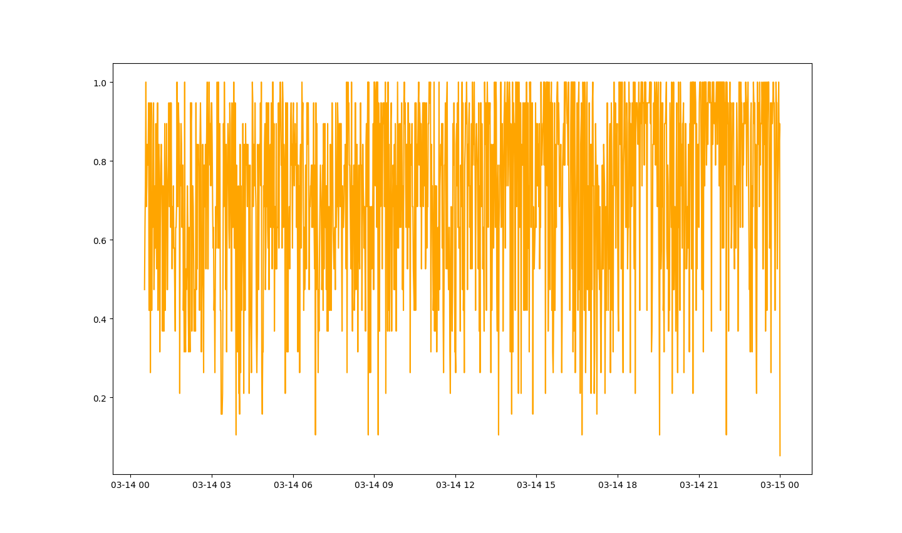
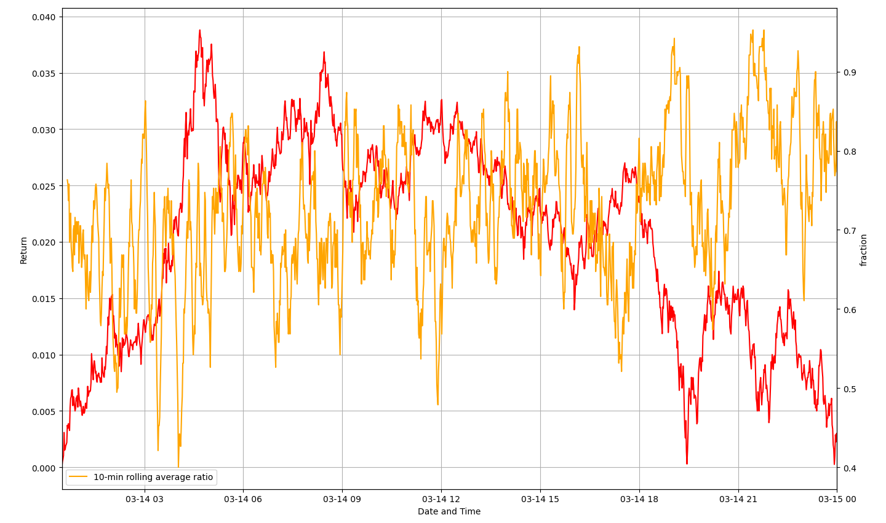

# Assignment2
risk management
## Abstract
The sudden fall of bitcoin price often leads to the fluctuation of related digital currencies. Whether different digital currencies have the same trend as bitcoin reflects the market's expectation for the future trend of digital currency. When the trend of most digital currencies is the same as that of bitcoin, it means that the market may rise or fall sharply in the future. Therefore, this paper quantifies the short-term (lag) selling risk measurement of such a risk control index.
## Reference material
[1] Mensi W ,  Rehman M U ,  Al-Yahyaee K H , et al. Time frequency analysis of the commonalities between Bitcoin and major Cryptocurrencies: Portfolio risk management implications[J]. The North American Journal of Economics and Finance, 2019, 48(APR.):283-294.
## Research process
### Data choose
We will analyze the market situation of bitcoin selling after it reached $61788 on March 13, 2021. Two days later, the price of bitcoin dropped to $54568.

### Calculate fraction(selling risk measurement of such a risk control index)
You can run btc_main.py to see the result.
We first calculate the return of BTC,Judge its price trend.Then,judge whether other digital currencies have the same trend.Finally,calculate the fraction.

### Analysis

We calculate the 10-min moving average of fraction to analysis.
We can see from the figure that there is a certain negative correlation between fraction and return, especially when bitcoin has a large downward trend, fraction tends to be close to 90%.This idea can be used to control the risk of bitcoin strategy, and avoid the risk by analyzing whether the trend of related digital currency and bitcoin is the same. When the value of fraction is high, we should pay attention to the falling crisis.
